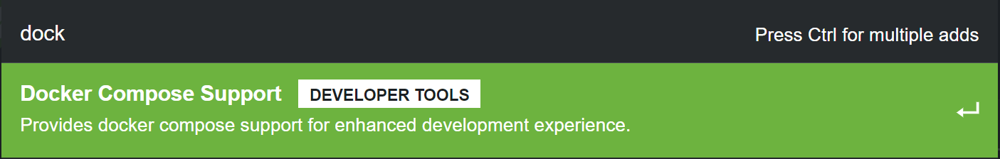
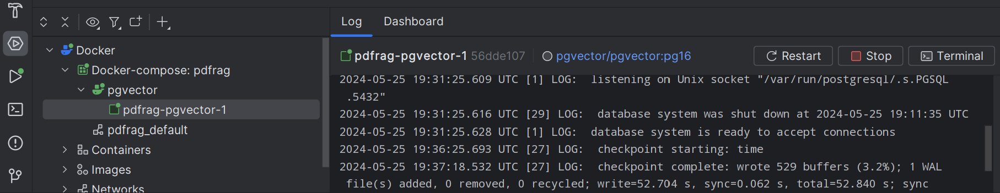

## Goal of this project:
This project meant to embed a pdf in pgVector store database so that we can ask we questions about the book (The application I wish I had in college !). The initial version will use openAi's models but in the future would like to try more open source models.

🗒️ This project is inspired by [Dan Vega's SpringAi PgVector Rag Tutorial](https://youtu.be/ZoPVGrB8iHU?si=Fqxy8QPgkey1lmoM)

## How to run:

1. This project requires docker compose support or docker desktop to consume the compose.yml  **Note** if you start both you may run  into issues- *see common issues*
2. Start services before running application this should create the vector db using the schema ddl and the compose.yml 

### Common issues
#### PSQLException: FATAL: password authentication failed for user

For this I referred to some really useful stackoverflow posts: 
1. [How to configure PostgreSQL to accept all incoming connections](https://stackoverflow.com/questions/3278379/how-to-configure-postgresql-to-accept-all-incoming-connections)
2. [Java Springboot application returning password authentication failed for user](https://stackoverflow.com/questions/45400538/java-springboot-application-returning-password-authentication-failed-for-user-p)

After these two I was able to get passed that pesky error **note if you're using intellij you don't and shouldn't start docker desktop as you can create situation where you have a collision in terms of listening to ports**.
